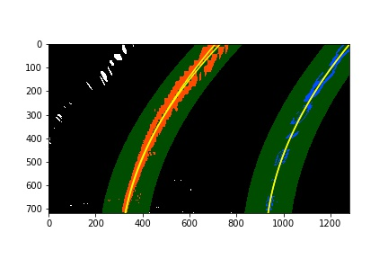

## Advanced Lane Finding

### View the demo!
https://youtu.be/HJcgVKZ4xrw

The goals / steps of this project are the following:

* Compute the camera calibration matrix and distortion coefficients given a set of chessboard images.
* Apply a distortion correction to raw images.
* Use color transforms, gradients, etc., to create a thresholded binary image.
* Apply a perspective transform to rectify binary image ("birds-eye view").
* Detect lane pixels and fit to find the lane boundary.
* Determine the curvature of the lane and vehicle position with respect to center.
* Warp the detected lane boundaries back onto the original image.
* Output visual display of the lane boundaries and numerical estimation of lane curvature and vehicle position.

The images for camera calibration are stored in the folder called `camera_cal`.  The images in `test_images` are for testing your pipeline on single frames.  If you want to extract more test images from the videos, you can simply use an image writing method like `cv2.imwrite()`, i.e., you can read the video in frame by frame as usual, and for frames you want to save for later you can write to an image file.  

## Camera Calibration

The code for this step is contained in the 3rd code cell of the IPython notebook.

I start by preparing "object points", which will be the (x, y, z) coordinates of the chessboard corners in the
world. Here I am assuming the chessboard is fixed on the (x, y) plane at z=0, such that the object points are
the same for each calibration image. Thus, objp is just a replicated array of coordinates, and objpoints
will be appended with a copy of it every time I successfully detect all chessboard corners in a test image.
imgpoints will be appended with the (x, y) pixel position of each of the corners in the image plane with
each successful chessboard detection. 
I then used the output objpoints and imgpoints to compute the camera calibration and distortion
coefficients using the cv2.calibrateCamera() function. I applied this distortion correction to the test
image using the cv2.undistort() function and obtained this result:

I save objpoints, imgpoints, mtx, and dist in a pickle named wide_dst_pickle.p file for later use.
I did this so it would be quicker to run and the need to recalibrate each time would not be necessary.

## Pipeline

### 1. Distortion Correction
#### Has the distortion correction been correctly applied to each image?

The code for undistorting can be seen in cell 2
To demonstrate this step, I will describe how I apply the distortion correction to one of the test images like this
one: 

Image after undistort:

Here's a side by side:

### 2. Has a binary image been created using color transforms, gradients or other methods?

I created a combined binary image using color and gradient thresholding in cell 5, as seen here

here's a side by side:

### 3. I applied a mask after the binary image was created

the code for creating a polygonal mask can be seen in block 12.

here you can see the binary-masked image:

### 4. Has a perspective transform been applied to rectify the image?

The code for my perspective transform includes a function called warp() , which appears in block 9 of the IPython file, 
Advanced-Lane_lines (Advanced-Lane-Lines.ipynb)The warp() function takes as inputs an image ( img ). I chose the hardcode the source and destination points which can be seen in cell 8 of the jupyter notebook.  

Here are the source points plotted:

Here is the binary-masked image after it has been warped:

### 5. identify lane pixels in warped image

Here you can see sliding windows used in the lane finding process:

